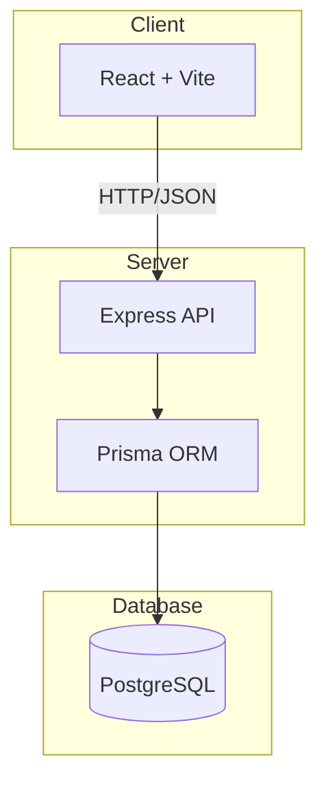
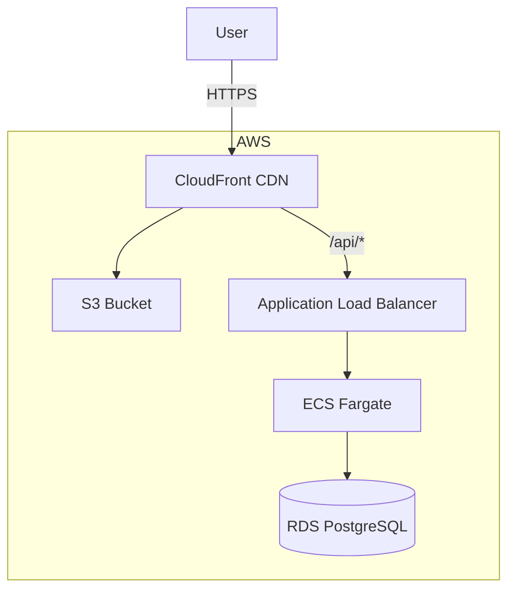
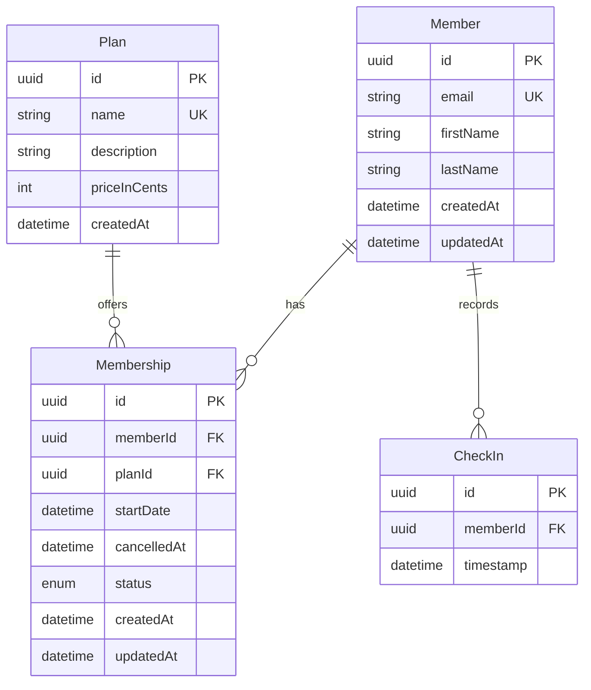

# Technical Specification

## Architecture



## AWS Target Deployment



## API Endpoints

### Members

| Method | Endpoint | Description |
|--------|----------|-------------|
| GET | /api/members | List members (optional `?search=`) |
| GET | /api/members/:id | Get member summary |
| POST | /api/members | Create member |

**POST /api/members**
```json
// Request
{ "email": "john@example.com", "firstName": "John", "lastName": "Doe" }

// Response 201
{ "id": "uuid", "email": "...", "firstName": "...", "lastName": "...", "createdAt": "...", "updatedAt": "..." }

// Error 409
{ "error": "Email already exists" }
```

**GET /api/members/:id**
```json
// Response 200
{
  "id": "uuid",
  "email": "john@example.com",
  "firstName": "John",
  "lastName": "Doe",
  "activeMembership": {
    "id": "uuid",
    "status": "ACTIVE",
    "startDate": "2024-01-01",
    "cancelledAt": null,
    "plan": { "id": "uuid", "name": "Basic", "priceInCents": 2999 }
  },
  "lastCheckIn": "2024-01-15T10:30:00Z",
  "checkInCountLast30Days": 12
}
```

### Memberships

| Method | Endpoint | Description |
|--------|----------|-------------|
| GET | /api/memberships/plans | List all plans |
| POST | /api/memberships | Assign plan to member |
| PATCH | /api/memberships/:id/cancel | Cancel membership |

**POST /api/memberships**
```json
// Request
{ "memberId": "uuid", "planId": "uuid", "startDate": "2024-02-01" }

// Response 201
{ "id": "uuid", "memberId": "...", "planId": "...", "status": "ACTIVE", ... }

// Error 409
{ "error": "Member already has an active membership" }
```

**PATCH /api/memberships/:id/cancel**
```json
// Request
{ "cancelledAt": "2024-03-01" }

// Response 200
{ "id": "uuid", "status": "CANCELLED", "cancelledAt": "2024-03-01", ... }
```

### Check-ins

| Method | Endpoint | Description |
|--------|----------|-------------|
| POST | /api/check-ins | Record check-in |

**POST /api/check-ins**
```json
// Request
{ "memberId": "uuid" }

// Response 201
{ "id": "uuid", "memberId": "...", "timestamp": "2024-01-15T10:30:00Z" }

// Error 403
{ "error": "Member does not have an active membership" }
```

## Database Schema



## Business Rules

1. **One Active Membership**: A member can have at most one active membership at a time
2. **Check-in Validation**: Only members with active membership can check in
3. **Cancellation Grace Period**: Members can check in until the effective cancellation date
4. **Membership History**: Cancelled memberships are preserved for audit/analytics

## Concurrency Handling

The "only one active membership" rule is enforced at two levels:

1. **Database Level** (safety net): Partial unique index
```sql
CREATE UNIQUE INDEX unique_active_membership_per_member
ON "Membership" ("memberId")
WHERE status = 'ACTIVE';
```

2. **Application Level** (better UX): Transaction with existence check
```typescript
return prisma.$transaction(async (tx) => {
  const existing = await tx.membership.findFirst({
    where: { memberId, status: 'ACTIVE' }
  });
  if (existing) throw new Error('Member already has an active membership');
  return tx.membership.create({ ... });
});
```

This dual approach ensures data integrity even under concurrent requests while providing meaningful error messages.

## If More Time

- Add pagination to member list
- Implement soft delete for members
- Add membership renewal/upgrade flow
- Add check-in history view
- Add API rate limiting
- Add request logging/monitoring
- Add E2E tests with Playwright
